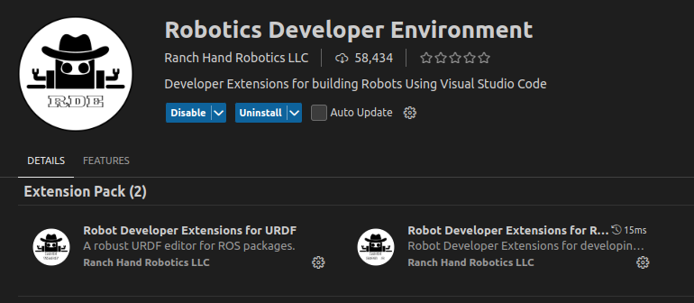

# ROS2 C++ and Python LSP setup

## clangd LSP

0. make sure you have pulled the latest main
1. Install the `clangd (LLVM)` vscode extension (you may be prompted to install clangd if you don't have it installed on your system)
2. Turn off intellisense from default C/C++ microsoft vscode extension
    - Add the following to your user settings `ctrl + shift + p` and select `Preferences: Open User Settings (JSON)`
    - add: `"C_Cpp.intelliSenseEngine": "disabled",`

3. you will need to `colcon build` and confirm there is a `compile_commands.json` file inside the `build/` directory 

**NOTE** Clangd only works if you generate a `compile_commands.json`. The `colcon_defaults.yaml` file in the root of this project automatically adds the cmake flag to generate this when you run `colcon build`. If you are setting up clangd for a different repository you should create a `colcon_defaults.yaml` file in the root of that project.

__If you are having issues with clangd try running `colcon build` again__.

__you can also try running `clangd: Restart Language Server`__ 


## C++ Formatting 

Add the following to your user settings.json (`ctrl + shift + p` and select `Preferences: Open User Settings (JSON)`)

```json
    "[cpp]": {
        "editor.defaultFormatter": "llvm-vs-code-extensions.vscode-clangd"
    },
```

optionally also add the following to save on format

```json
    "editor.formatOnSave": true,
```

If you want to auto-format using the terminal, run:
```
find . -name "*.cpp" -o -name "*.h" | xargs clang-format -i -style=file
```

## Python 

1. Install the `Python` and `Pylance` extensions by microsoft
2. install `Robot Developer Extensions for Ros2` by `Ranch Hand Robotics LLC`

3. Install `Ruff` by Astral Software
3. run `ROS2: Update Python Path` (you may need to run this periodically when you add new files or make major changes)
4. you can verify it worked by checking `.vscode/settings.json` and seeing it has added python auto complete and analysis extra paths.
5. you should now have type hints for ros msg definitions and custom msg definitions like tr_messages inside python! 


## Details and extra info 

- there is a `colcon_defaults.yaml` that passes the cmake arg `-DCMAKE_EXPORT_COMPILE_COMMANDS=ON` by default if you run `colcon build`

- formatting style guide can be found inside the `.clang-format` file